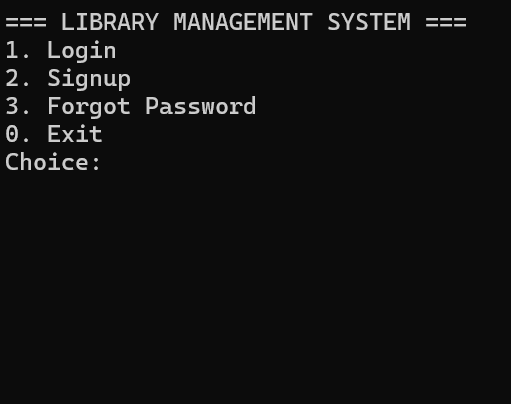
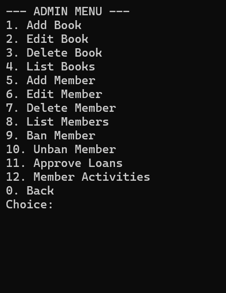

#LIBRARY MANAGMENT SYSTEM
                                <h1>---GROUP MEMBERS---</h1>

<b>Qamar Abbas (25014119-024)</b>
                                
<b>Syed Safi Haider (25014119-209)</b>

<b>Leeza Shehzadi(25014119-232) </b>

<b>Khuzama Aleem (25014119-053)</b>

----------------------------------------------------------------------------------------------------
<h1>Features</h1>

<h3>Login Page</h3>

<h3> Admin Section</h3>

<h3> Member Section </h3>

----------------------------------------------------------------------------------------------------
<b>git clone https://github.com/qamarabbas-024/Library-Managment-System.git</b>

or

<b>git@github.com:qamarabbas-024/Library-Managment-System.git</b>

<b>cd Library-Managment-System</b>

in terminal paste:
<b>.\LibrarySystem.exe</b>

or 
type lib then TAB key 

signup first then login to access member features.

to access Admin features use 

username: <b>qamarabbas01</b>

password: <b>password</b>

or 
username: <b>safi02</b>

password: <b>pass</b>

there are multipal features test them and give me feedback. this is not the real project it was just made to get a view, how the project will look at end. 

Thank you.
